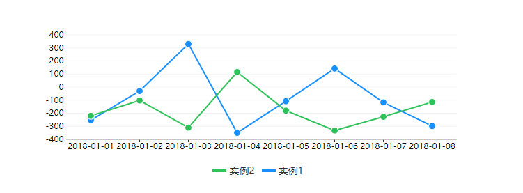

<p align="center">
  
</p>


# sCharts
#### simple svg charts with zero dependencies
<a href="https://github.com/facejiong/sCharts/blob/master/docs/all.png">
  more
</a>

[](https://travis-ci.org/facejiong/sCharts)
[](https://david-dm.org/facejiong/sCharts)
[](https://www.npmjs.com/package/sCharts)


### Contents
* [Installation](#installation)
* [Usage](#usage)
* [Updates](#updates)
* [License](#license)

#### Installation
* Install via [`npm`](https://www.npmjs.com/get-npm):

  ```console
  $ npm install scharts
  ```

  and include in your project:
  ```js
  import Chart from "scharts"
  ```

* ...or include within your HTML

  ```html
    <script src="./Charts.js"></script>
  ```

#### Usage
```js
const data0 = [
	{
		label: '实例1',
		value: 234
	},
	{
		label: '实例2',
		value: 100
	},
	{
		label: '实例3',
		value: 500
	},
		{
		label: '实例4',
		value: 400
	}
]
const pieChart = new Chart({
	id: 'pie-chart',
	title: 'Pie Chart',
	data: data0,
	type: 'pie', // or 'line', 'scatter', 'pie', 'percentage', 'scatter'
	height: 250,
	width: 640,
	sortDataType: 'descending', // ascending descending none
})
```
View Examples:

1. Clone this repo.
2. `cd` into project directory.
3. `npm install -g parcel`
4. `npm run example`

If you want to contribute:

1. Clone this repo.
2. `cd` into project directory
3. `npm install`
4. `npm run build`

#### Updates

##### v0.0.1
- The very first version out, with pie, percentage, bars, lines and scatter.

#### License
This repository has been released under the [MIT License](LICENSE)

------------------
Project maintained by facejiong

